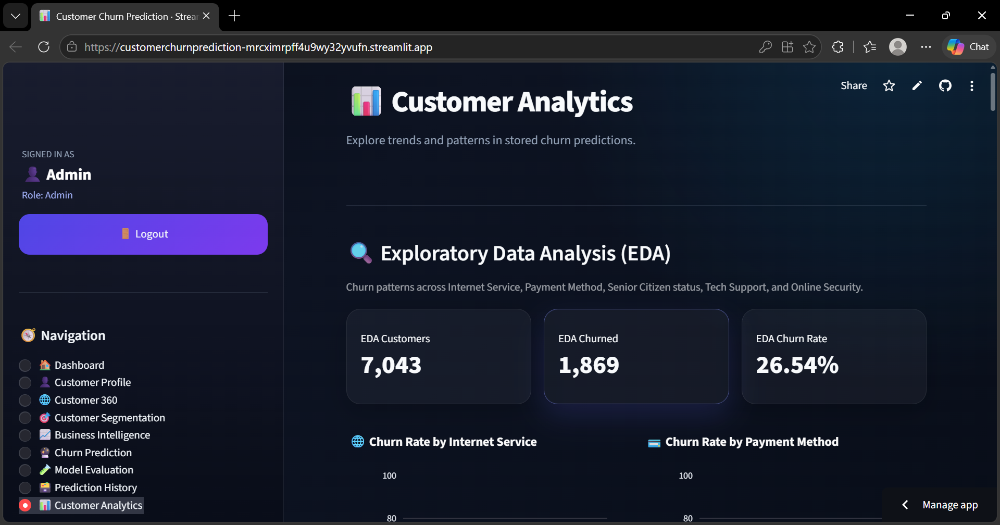

# 📊 Customer Churn Prediction

A machine learning-based web application that predicts customer churn using a **Random Forest Classifier** and provides interactive customer analytics through **Streamlit**.

## 🚀 Live Demo

🌐 **Live Application:**

https://customerchurnprediction-mrcximrpff4u9wy32yvufn.streamlit.app/

## 📌 Project Overview

Customer churn prediction helps businesses identify customers who are likely to leave their service.

This project uses customer data and a trained Random Forest machine learning model to predict whether a customer is likely to churn.

The application provides an interactive dashboard with customer analytics, churn prediction, segmentation, business intelligence, model evaluation, and prediction history.

## ✨ Features

* 🔐 Admin Login
* 📊 Interactive Dashboard
* 👤 Customer Profile
* 🌐 Customer 360
* 🎯 Customer Segmentation
* 📈 Business Intelligence
* 🤖 Customer Churn Prediction
* 🧪 Model Evaluation
* 📋 Prediction History
* 📊 Customer Analytics
* 📉 Contract-wise Churn Analysis
* 🌲 Random Forest Machine Learning Model

## 🖥️ Application Screenshots

### 🏠 Dashboard



### 🤖 Churn Prediction


### 🧪 Model Evaluation


### 📊 Customer Analytics


## 🤖 Machine Learning

### Model Used

**Random Forest Classifier**

The trained model is stored in:

```text
data/random_forest_model.pkl
```

Supporting model files:

```text
data/feature_names.pkl
data/model_columns.pkl
```

## 📊 Model Performance

| Metric   | Score |
| -------- | ----: |
| Accuracy | 75.20% |
| ROC-AUC  | 83.79% |
| F1 Score | 62.99% |
| Model    | Random Forest |

## 🛠️ Technologies Used

* Python
* Pandas
* NumPy
* Scikit-learn
* Streamlit
* Plotly
* Joblib
* SQLite
* Git
* GitHub

## 📁 Project Structure

```text
Customer_churn_prediction
│
├── data
│   ├── customer_churn.csv
│   ├── feature_names.pkl
│   ├── model_columns.pkl
│   └── random_forest_model.pkl
│
├── screenshots
│   ├── dashboard.png
│   ├── churn_prediction.png
│   ├── model_evaluation.png
│   └── customer_analytics.png
│
├── src
│   └── app.py
│
├── requirements.txt
├── README.md
└── .gitignore
```

## 💻 Run Locally

### 1. Clone the repository

```bash
git clone https://github.com/Vishnuvardhan2231/Customer_churn_prediction.git
```

### 2. Open the project

```bash
cd Customer_churn_prediction
```

### 3. Create virtual environment

```bash
python -m venv venv
```

### 4. Activate virtual environment

Windows:

```bash
venv\Scripts\activate
```

### 5. Install dependencies

```bash
pip install -r requirements.txt
```

### 6. Run the Streamlit application

```bash
streamlit run src/app.py
```

The application will open in your browser.

## ☁️ Deployment

The application is deployed using **Streamlit Community Cloud**.

### GitHub Repository

https://github.com/Vishnuvardhan2231/Customer_churn_prediction

### Live Application

https://customerchurnprediction-mrcximrpff4u9wy32yvufn.streamlit.app/

## 📌 Project Objective

The main objective of this project is to use machine learning to identify customers who may be at risk of churn and provide an interactive dashboard that helps analyze customer behavior and churn patterns.

## 👨‍💻 Author

**Chowdam Vishnuvardhan**

Electronics & Communication Engineering

GitHub:

https://github.com/Vishnuvardhan2231

---

⭐ If you find this project useful, consider giving the repository a star.
